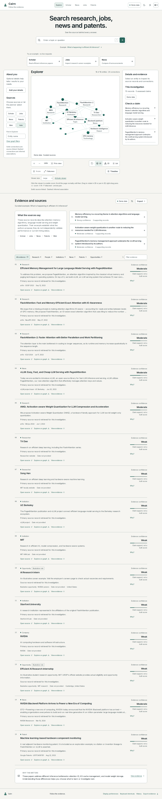


<!-- brand:start -->
# Cairn

**Follow the evidence.**

Search research, jobs, news and patents. See the source behind every answer.
<!-- brand:end -->

## The problem

Search results spread facts across papers, organisations, career pages and reporting. AI summaries can obscure which source supports a statement, what is merely inferred, and what remains unknown. Cairn gives those records a shared, inspectable workspace with original URLs, quotes, relationships and conservative confidence explanations.

## Who it helps

- Students and researchers choosing what to read and which question to investigate.
- Job seekers comparing **quoted** requirements with their own skills and experience.
- Readers checking a specific news claim against source excerpts.
- Inventors finding related patent records and references as a starting search.

## Three preloaded scenarios

The homepage offers three examples that make **zero search or model requests**:

1. **Scholar — Read efficient-inference papers.** Follow FlashAttention, PagedAttention and AWQ, inspect exact abstract excerpts, reading order, a source-grounded glossary and APA/MLA/IEEE/BibTeX citations.
2. **Jobs — Inspect research career examples.** Explore clearly labelled illustrative career shapes and official opportunity portals. Add skills to try matching, and see **Not stated** wherever actual eligibility, deadline or salary is absent. These are not current vacancies or invented employer requirements.
3. **News — Compare AI announcements.** Compare the historical vLLM introduction and NVIDIA Blackwell announcement, inspect their dates and quoted statements, and distinguish a company’s assertion from independent confirmation.

Demo paper and announcement excerpts were checked against their original pages on **6 October 2026**. They remain historical examples, never merged into live results. See [verification notes](docs/demo-sources.md).

## Screenshots

| Desktop · 1440px | Mobile · 390px |
| --- | --- |
| [](docs/screenshots/cairn-1440-light.png) | [](docs/screenshots/cairn-390-light.png) |

[Dark desktop](docs/screenshots/cairn-1440-dark.png) · [Mobile optional profile](docs/screenshots/cairn-390-profile.png) · [Source quotes and evidence](docs/screenshots/cairn-evidence.png)

Regenerate screenshots with `npm run screenshots`. The script starts its own server on port **3101** and checks that no POST/search/model requests occurred.

## Run locally

Requirements: **Node.js 22+**, npm, and Docker or PostgreSQL for live investigations. Demo works without either API key or a database.

```bash
npm install
# Configure ignored .env.local from .env.example for live search.
npm run db:up
npm run db:migrate
npm run dev
```

Open **http://localhost:3000**. Start with **Demo data**, or select **Live** for your own question. PostgreSQL is isolated on `127.0.0.1:15432` with a persistent Docker volume. Search and model keys are not passed to the database container.

```bash
npm run build
npm start
```

Deploy on a Node-runtime host supporting streamed requests of up to five minutes. Set `APP_HTTPS=true` behind HTTPS, configure the daily budget and run migrations first.

## Workspace and accessibility

Warm off-white is the default; dark theme and display preferences persist on the device. Inter is served through `next/font`. Body text is at least 16px, secondary text 14px, graph labels 14px, and Large text scales the interface **25%**. High contrast, reduced motion, simple-language synthesis and a structured screen-reader list remain available.

The desktop workspace has **About you/filters → Explorer → details/evidence**. Mobile stacks these sections and defaults to 2D. Every graph record is available in List.

### Explorer

- Framed viewer, normally about **70vh**, with Compact/Large/Full presets.
- Wheel scrolling belongs to the page until you click/activate the viewer. **Esc** releases focus.
- Zoom in/out, fit, reset, auto-rotation, 3D/2D/List and fullscreen. Fullscreen preserves zoom and returns to the previous page position.
- Drag rotates in 3D or pans in 2D; right-drag pans; double-click focuses. Touch supports rotation/panning and pinch zoom.
- Auto-rotation takes approximately **75 seconds/turn**, pauses on hover/selection/interaction, and resumes after four idle seconds. Reduced motion disables it.
- ResizeObserver-driven fitting; smooth 600ms camera fit; stable positions when new neighbours arrive. Labels are prioritised and collision-tested, with more revealed at higher zoom.
- Instanced nodes above 300; batched solid/dashed edges; initial 1,000-node cap with explicit Show more.

Viewer shortcuts: **+ / −** zoom, **0** fit, **F** fullscreen, arrows pan, **Esc** release/close. App shortcuts: **/** search, **Cmd/Ctrl K** commands, **G/S/N/J/P** modes, **T** timeline, **?** shortcuts.

Solid connections come from source-linked metadata. Dashed connections are inferred associations. **Strong / Moderate / Weak** confidence describes claim support, not probability, bias, hiring likelihood or a truth score. Use **Why?** and the evidence drawer to inspect the rationale and exact quotes.

## Optional profiles and privacy

Each mode starts with four to six key fields, then **Add more detail**. Forms share Zod schemas with `POST /api/search`, validate inline and can be skipped.

- **Jobs:** roles, job type, experience, education, leveled skills/must-haves, locations, arrangement/relocation, optional salary, availability, languages, certifications and authorization. Requirement counts use quoted skills/experience/qualification text; missing fields remain Not stated. Text matching does not establish degree equivalence or hiring eligibility.
- **Scholar:** goal, education/field, date range, paper/access preferences, citations/sorting, reading level and citation style. Reading order and glossary are based on returned text; no full-paper understanding is assumed.
- **News:** goal, optional pasted claim, topic/region/time range, source types, language and reading level. Timelines and supports/conflicts/context are claim-specific; no bias score or truth percentage.
- **Patents:** idea, purpose, jurisdiction/date/status preferences, companies/inventors, keywords and user role. Status filters apply only where explicitly returned. **This is a starting search, not legal advice or a full novelty search.**

Details are held in **sessionStorage for this tab**. Display preferences/theme use localStorage; personal profile fields do not. **Clear my details** clears all mode details from the tab.

Live search sends the current profile and question to Ollama for planning, and source excerpts for grounded answers. Relevant role/topic/location/date/keyword terms go to SerpApi. Salary/grades/authorization are not copied into deterministic search terms. Local `.txt` résumé import reads only in the browser; the user reviews detected skills before adding them, and the résumé file is never uploaded. Providers have their own processing/retention policies.

Without **Save with this investigation**, profile-shaped live runs skip Cairn’s persistent LangGraph checkpoints, model/source-response caches and final investigation snapshot. Only the original query/request accounting remains in the database. Explicit save consent applies to the next successful investigation; a saved profile can be reopened with that snapshot. Profiles reuse the existing planner/ranker and **do not add search calls**.

## How live investigations work

```text
Next.js + Zustand → validated POST /api/search → streamed progress
                                  ↓
LangGraph: analyzer → router → planner
       ↓ one query per relevant/selected source, maximum five
Official SerpApi MCP: Scholar / Jobs / News / Patents / Web
       ↓
Normalizer → entities → extraction → profile-aware ranking
       ↓
Conflict candidates → graph → answer → quote/ID/confidence validation
       ↓
Evidence workspace (+ PostgreSQL snapshot when persistence is allowed)
```

Ollama handles existing routing, extraction and synthesis calls. Normalization, metadata relationships, ranking, quote checks and confidence caps are deterministic. Model routing defaults are `nemotron-3-nano:30b` (router), `gpt-oss:20b` (extract), `gpt-oss:120b` (synthesis), `nemotron-3-super` (comparison), `nemotron-3-ultra` (explicit deep investigation), and `gemma4:31b` (simple language). Structured JSON is Zod-validated with at most one repair attempt.

Enrichment and additional pages are **on demand**. Actual returned Scholar author/citation IDs, patent IDs and Jobs/related-question pagination tokens are required. Google Scholar Cite formats bibliography; cited-by expansion uses Scholar’s `cites` parameter. Google Jobs Listing is used only for returned employer ratings. Trends means relative search interest, not research output.

### Evidence and budget rules

- Every generated supporting/conflicting claim requires known evidence IDs and verbatim quotes; unknown entities and unsupported/dangling links are rejected.
- High confidence requires independent primary confirmation. Shared authors, repeated coverage and multiple secondary reports do not establish it.
- AI-extracted associations stay inferred. Dates preserve source precision. Missing eligibility, affiliations, status, deadlines and citations are not invented.
- At most **5 initial SerpApi attempts/investigation**, **2 concurrent search calls**, **2 concurrent model calls**, and **25 attempts per UTC day** by default.
- Budgets are transactionally reserved before calls, including failed attempts; up to three investigations/session/minute. User-requested pagination stays inside the same daily budget.
- Ordinary news/jobs responses cache for 15 minutes; other source/model responses for one hour. Private profile-shaped responses skip persistent writes. Provider-side caching remains enabled.
- Both API keys are server-only, never `NEXT_PUBLIC_`; diagnostics/snapshots are redacted. Same-origin mutation endpoints, aborts/timeouts, retries and partial results are supported.

## Checks

See [the renovation change list and verification notes](docs/changes.md) for affected files and remaining limits.

```bash
npm run brand:check
npm run lint
npm run contrast:check
npm run typecheck
npm test
npx playwright install chromium
npm run test:e2e
npm run build
npm run verify:secrets
npm run screenshots
```

Unit tests cover engine contracts, provenance/confidence, source-scoped examples, graph collisions/stability, validation/query shaping, consent-dependent persistence and exports. Browser checks cover scrolling/focus/fullscreen, labels/reduced motion, large-graph instancing, themes/WCAG AA, mobile, profiles/storage/résumé import, zero-request examples, evidence, commands, pagination-compatible UI, exports and failures. Automated tests and screenshots make **no paid API calls**. Browser tests use isolated port **3100** and `.next-tests`.

`npm run test:live` is a separate, manual two-source smoke check requiring configured credentials and a running app; it is excluded from normal verification.

## Limits and working-name status

Search excerpts are incomplete; they cannot prove methodology, universal consensus, current hiring eligibility, full patent-claim differences or legal novelty. Missing summaries/definitions/requirements stay explicit. Résumé import currently accepts `.txt`, not PDF/DOCX. The regular browser suite uses Chromium; other engines and physical multi-touch devices need separate validation.

**Cairn is a working name:** `cairn.com` is occupied and Cairn.info is an established academic platform. The user accepted the name after review; official trademark clearance is unresolved. See [naming check](docs/name-check.md). Edit `src/lib/brand.ts` and run `npm run brand:sync` to update the generated package/README/icon branding.

Main code: `src/components/knowledge-app.tsx` (workspace), `src/components/graph/` (viewer/renderers), `src/components/profile-*.tsx` and `src/lib/profile*.ts` (profiles), `src/lib/personalization.ts` (grounded ranking/checklists), `src/server/agent.ts` (LangGraph), `src/server/serpapi.ts`/`ollama.ts` (providers), `src/server/graph-builder.ts` (provenance), `src/server/storage.ts` (persistence), `src/server/export.ts` (reports), and `src/app/api/` (server endpoints).

Official references: [SerpApi MCP](https://serpapi.com/mcp), [SerpApi engines](https://serpapi.com/search-engine-apis), [Ollama Cloud](https://docs.ollama.com/cloud), [LangGraph](https://docs.langchain.com/oss/javascript/langgraph/overview).
